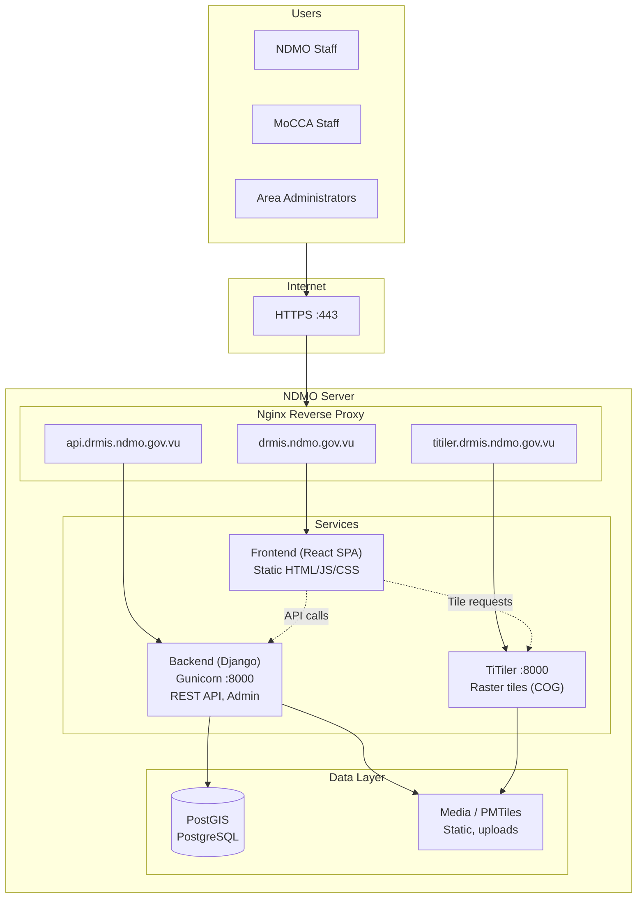
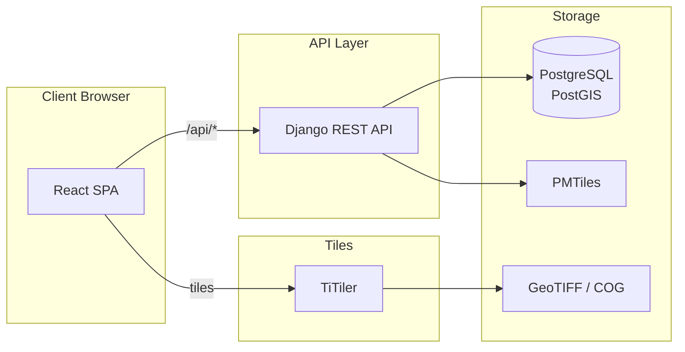

# Disaster MIS – Architecture Diagram

## High-Level Architecture (Production)

```
                                    ┌─────────────────────────────────────────────────────────────┐
                                    │                    Users (NDMO / MoCCA)                     │
                                    └─────────────────────────────────────────────────────────────┘
                                                              │
                                                              ▼
                                    ┌─────────────────────────────────────────────────────────────┐
                                    │                    HTTPS (Port 443)                         │
                                    │  drmis.ndmo.gov.vu  │  api.drmis.ndmo.gov.vu  │  titiler... │
                                    └─────────────────────────────────────────────────────────────┘
                                                              │
                                                              ▼
┌─────────────────────────────────────────────────────────────────────────────────────────────────────────────────────┐
│                                          NDMO Server (Docker)                                                          │
│  ┌─────────────────────────────────────────────────────────────────────────────────────────────────────────────────┐  │
│  │                                         Nginx (Reverse Proxy)                                                    │  │
│  │  ┌──────────────────┐  ┌──────────────────┐  ┌──────────────────┐                                               │  │
│  │  │ drmis.ndmo.gov.vu │  │ api.drmis.ndmo... │  │ titiler.drmis... │                                               │  │
│  │  │ → Static SPA      │  │ → Django API      │  │ → TiTiler        │                                               │  │
│  │  └────────┬─────────┘  └────────┬─────────┘  └────────┬─────────┘                                               │  │
│  └───────────┼─────────────────────┼─────────────────────┼───────────────────────────────────────────────────────┘  │
│              │                     │                     │                                                             │
│              ▼                     ▼                     ▼                                                             │
│  ┌──────────────────┐  ┌──────────────────┐  ┌──────────────────┐  ┌──────────────────┐  ┌──────────────────┐       │
│  │ Frontend (SPA)    │  │ Backend (Django) │  │ TiTiler          │  │ PostGIS          │  │ Media / PMTiles  │       │
│  │ React + Vite      │  │ Gunicorn         │  │ Raster tiles      │  │ PostgreSQL       │  │ Static files      │       │
│  │ Static files      │  │ REST API         │  │ COG/GeoTIFF      │  │ Spatial data     │  │ Uploads, .pmtiles│       │
│  └──────────────────┘  └────────┬─────────┘  └────────┬─────────┘  └──────────────────┘  └──────────────────┘       │
│                                 │                     │                                                                 │
│                                 └─────────────────────┴─────────────────────────────────────────────────────────────  │
└─────────────────────────────────────────────────────────────────────────────────────────────────────────────────────┘
```

## Component Diagram (Mermaid)



## Data Flow



## Deployment Stack (Docker Compose)

| Service   | Port | Role                                      |
|-----------|------|-------------------------------------------|
| **nginx** | 80   | Reverse proxy, static frontend, SSL term  |
| **web**   | 8000 | Django + Gunicorn (API, admin)            |
| **titiler** | 8000 | Raster tile service (COG)                |
| **postgres** | 5432 | PostGIS database                        |

## Subdomain Mapping (Recommended)

| Subdomain                 | Service  | Purpose                    |
|---------------------------|----------|----------------------------|
| `drmis.ndmo.gov.vu`       | Frontend | Web app (React SPA)        |
| `api.drmis.ndmo.gov.vu`   | Backend  | Django REST API, admin     |
| `titiler.drmis.ndmo.gov.vu` | TiTiler | Map raster tiles         |

Subdomains are preferred over path-based routing (`/api/`, `/titiler/`) for easier maintenance and independent updates. See [DEPLOYMENT_ROUTING.md](DEPLOYMENT_ROUTING.md).

## Departmental MIS Integration (Bidirectional)

| Direction | Purpose |
|-----------|---------|
| **Read** | Other systems read tabular data: `GET api/v1/integrations/tabular/`, `.../data/`, `.../aggregate/` |
| **Push** | Other systems push data: `POST api/v1/integrations/tabular/ingest/` |
| **Pull** | Disaster MIS syncs from external APIs: `./manage.py sync_external_data` (Admin: External Data Sources) |

**Auth**: `X-API-Key` or `Authorization: ApiKey <key>`

See [INTEGRATION_DEPARTMENTAL_MIS.md](INTEGRATION_DEPARTMENTAL_MIS.md) for full documentation.
